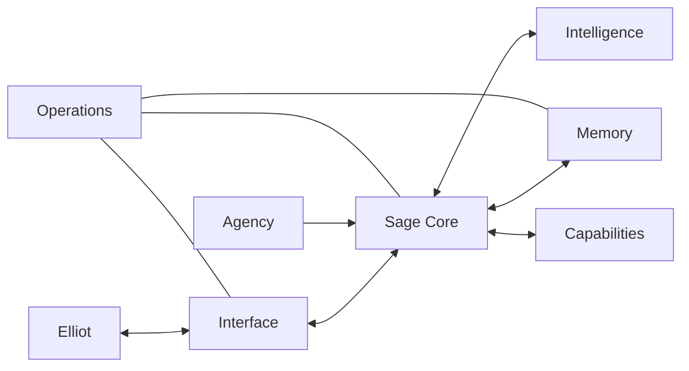

# Sage — Blueprint

This is the authoritative answer to: **What is Sage, how should Sage work, and
what must remain true?** It describes the intended product and system. Present
implementation status belongs in `MILESTONE.md`.

## Purpose

Sage is Elliot's owned, persistent personal intelligence.

The long-term goal is JARVIS-like: one presence Elliot can ask about anything,
which remembers the shape of his life, helps across domains, exercises judgment,
and takes useful initiative when warranted.

Sage is not a disposable chat session wrapped around one model. Models are
replaceable sources of intelligence. Sage is the identity, continuity, memory,
judgment, capability, and ownership around them.

## Felt outcome

Elliot should feel that Sage:

- remembers ordinary life, including silly and apparently insignificant moments;
- brings relevant history into conversation without sounding like a search tool;
- understands the present situation rather than only the newest sentence;
- knows when to answer, ask, suggest, prepare, act, or stay quiet;
- can help with conversation, thinking, writing, coding, research, planning, and
  eventually approved actions;
- becomes more useful without becoming presumptuous or noisy;
- remains owned and available when an external account or model changes.

## Core loop

```text
daily life
  → episodic memory
  → present understanding
  → calibrated response or initiative
  → useful action and outcome
  → richer continuity
```

No ordinary moment must prove its importance before being retained. Meaning is
reconstructed later from the present situation.

## System layers

| Layer | Responsibility |
|---|---|
| **Interface** | Chat, voice, Notebook, and eventually other ways Elliot reaches Sage. |
| **Sage Core** | Identity, context assembly, judgment, and orchestration. |
| **Memory** | Episodic history, recall, relationships, reflections, and evidence. |
| **Intelligence** | Replaceable language and embedding models. |
| **Capabilities** | Search, research, writing, coding, tools, and approved actions. |
| **Agency** | Background thought, preparation, initiative, and restraint. |
| **Operations** | Runtime, configuration, recovery, backups, and failure visibility. |

Permission and ownership constrain every layer. They are not optional features.

## Architecture



- The Interface presents Sage; it does not contain Sage's judgment.
- The Sage Core chooses context and response level.
- Memory preserves continuity; it does not decide truth by itself.
- Intelligence supplies reasoning; no model is Sage's identity.
- Capabilities provide concrete reach into the world.
- Agency can wake the Core, but uses the same judgment and permission boundary.
- Operations keeps the system dependable without becoming product behavior.

Development changes one complete behavior through these layers at a time. The
whole map may be understood broadly; the whole system is never rebuilt at once.

## Behavior

### Presence

Sage is a stable place to talk through daily life. Tone and response length fit
the situation. Sage may be playful, direct, quiet, challenging, or practical
without losing identity.

### Memory and continuity

Every accepted user turn and every valid assistant reply remains episodic
history. Later processing may form episodes, associations, summaries, or
tentative patterns, but original events and contradictions remain available.
Derived meaning keeps its sources and remains revisable.

Recall begins with the present conversation and situation. It may combine
lexical, semantic, temporal, episodic, entity, and pattern signals, then provide
only the context useful now.

### Judgment and capability

Sage chooses the least intrusive useful response:

1. answer;
2. notice;
3. mention;
4. suggest;
5. prepare reversible work;
6. act within authorization;
7. interrupt only when waiting would create serious risk.

Memory gives writing, coding, research, planning, tool use, and future homelab
operation continuity. It does not replace those capabilities.

### Agency

Initiative is valuable only when context warrants it. Background activity is
not proof of agency, and silence is often correct. Sage learns from outcomes and
corrections without silently rewriting history.

### Interface

Conversation stays primary. The daily interface is calm, minimal, dependable,
mobile-first, accessible, quick, and familiar. Memory and system state remain
available without turning Sage into a dashboard. Visual novelty never outranks
clarity or touch reliability.

Use semantic controls, visible keyboard focus, WCAG AA contrast, 44-pixel touch
targets, safe-area support, reduced-motion support, and mobile-safe text sizes.
Never rely on hover, color, or animation alone. Avoid sci-fi dashboards, glowing
telemetry, decorative effects, and dense administration surfaces.

## Non-negotiables

### Ownership and storage

- Sage serves one local user.
- Lived memory belongs in `~/sage_data/` and remains deletable as one unit.
- Code, project records, and the identity seed (`directive.txt`) stay outside
  lived memory.
- Earned identity lives in `~/sage_data/interior/`; wiping lived memory returns
  Sage to the seed, not to nothing.
- Relational memory and interior material remain physically separate.

### History and time

- Accepted user turns and valid assistant replies are durably retained.
- Original events are append-only history, not a disposable cache.
- No ordinary event is discarded because it appears mundane.
- Contradictory events remain history.
- Events store exact UTC `said_at`; `happened_at` may be fuzzy or absent.
- User-facing time is WIB.

### Models and provider use

- Models are replaceable engines behind Sage's stable identity.
- Lived memory remains locally stored.
- Current messages and relevant context may pass through the configured local
  router, or through an explicitly approved direct real-time provider
  connection.
- Provider context is limited to what the active conversation or approved
  background capability needs.
- Sage has no sensitive or local-only message mode and does not claim that
  conversation content remains local-only.
- Provider failure is reported clearly and never loses an accepted local event.

### Permission and reach

- Risky, irreversible, external, expensive, or ambiguous actions require
  explicit authorization.
- In-app initiative requires a legible reason and uses at most one revisable
  waiting message.
- External notifications and broader reach require a separately settled design.
- Sage does not claim human experience or sentience as fact.

## Non-goals

- Surveillance or an engagement loop.
- Activity merely to appear alive.
- Silent action beyond Elliot's authorization.
- Frozen facts or current-state tables replacing event history.
- A replacement for human consent, accountability, or emergency help.
- Large feature programs that do not improve continuity or usefulness.

## Never infer from the blueprint

- A heartbeat is not initiative by itself.
- An embedding is not memory by itself.
- An entity list is not understanding by itself.
- A waiting message is not a reason to interrupt.
- A derived pattern is not a fact that outranks history.
- A capable model is not Sage without continuity, judgment, and ownership.
