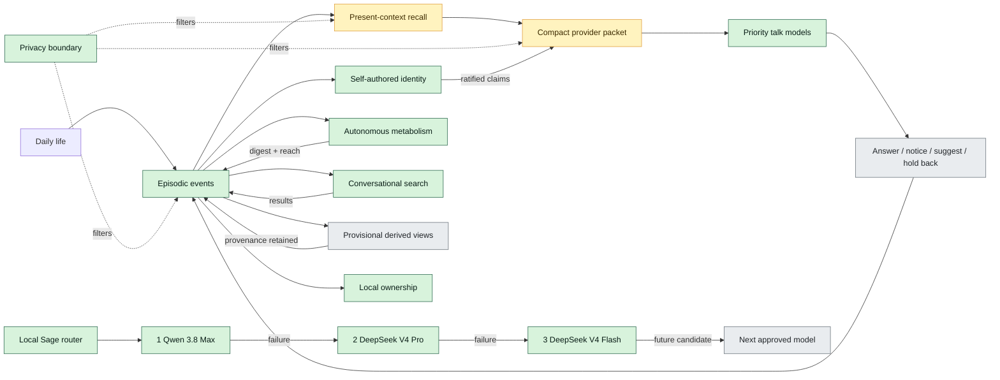

# Sage — Long-Hold Roadmap

This is the visual memory of what Sage is becoming and what has actually been
built. It complements the authority records; it does not replace the North
Star, invariants, decisions, blueprint, or milestone.

## Whiteboard

## Progress

### Foundation — present

- Local browser and terminal presence.
- Append-only UTC episodic event history.
- Durable assistant replies and provider-failure preservation.
- Local Qwen3 embedding recall.
- Sensitive and unknown-privacy exclusion.
- Separate relational memory and interior material.
- Notebook, reflections, entities, and bounded waiting message.
- Background extraction with retry-safe completion records.
- SQLite mirrors dual-written alongside JSONL.

### Intelligence routing — present

- Ordered talk-model failover: Qwen 3.8 Max, DeepSeek V4 Pro, DeepSeek V4 Flash.
- An unusable or failed response falls through before an assistant event is saved.

### Self-authored identity — present

- Heartbeat detects self-observations and proposes identity claims.
- Elliot ratifies or rejects proposals through the Notebook UI.
- Ratified claims compose into the system prompt.

### Conversational search — present

- Sage decides mid-conversation when she needs web search.
- Results stored as episodic events with source URLs and timestamps.
- Sensitive material excluded from search queries.

### Autonomous metabolism — present

- Post-conversation gap scan, web exploration, digest reflection, waiting-message reach.
- Each stage gates the next; silence is the default outcome.
- Triggered by configurable silence window after last conversation.

### Felt continuity — next

- Relevant older moments influence replies without sounding like search.
- Contradictions remain available without forced resolution.
- Ordinary conversations demonstrate continuity.
- The selected priority chain is evaluated in real daily use.

### Later horizons

1. Episodes, associations, and tentative patterns with provenance.
2. Broader writing, coding, research, planning, and tool capability.
3. Calibrated preparation and action with explicit authorization.
4. Richer interfaces only when they improve ownership and daily usefulness.

## Guardrails

- No model replaces the event record.
- No provider receives sensitive or unknown material.
- No model failure loses an accepted user event.
- No derived view silently outranks contradictory history.
- No external, risky, irreversible, or ambiguous action happens without permission.
- No background activity is added merely to appear alive.

## Source of truth

- Purpose and felt outcome: `docs/NORTH_STAR.md`
- Permanent constraints: `docs/INVARIANTS.md`
- Behavior sequence: `docs/BLUEPRINT.md`
- Current acceptance checks: `docs/MILESTONE.md`
- Settled choices: `docs/DECISIONS.md`
