# Sage — Timeline

This is Elliot's visual context map. Read left to right: what Sage became, where
development stands now, and what comes next. Technical completion evidence lives
in `MILESTONE.md`; settled reasoning lives in `DECISIONS.md`.

[Open the interactive project whiteboard](timeline-whiteboard.html). The
whiteboard is a presentation of this record; this file remains authoritative.

## Journey

```mermaid
flowchart LR
    F["FOUNDATION<br/>Aug 10–15<br/>Chat becomes durable"]
    M["MEMORY<br/>Aug 17–20<br/>History becomes recallable"]
    R["REFRESH<br/>Aug 24–29<br/>Continuity becomes the goal"]
    W["IDENTITY + WONDER<br/>Sep 1–3<br/>Sage reflects and explores"]
    S["SIMPLIFICATION<br/>Sep 6<br/>Sensitive mode retired<br/>Audit drift repaired"]
    N["ARCHITECTURE MAP<br/>Sep 6<br/>One system, clear layers"]
    C["NOW<br/>FELT CONTINUITY<br/>Memory changes conversation"]
    P["NEXT<br/>CAPABILITY<br/>Broader useful work"]
    A["LATER<br/>AGENCY + PRESENCE<br/>Approved action, voice, reach"]

    F --> M --> R --> W --> S --> N --> C --> P --> A

    classDef past fill:#d8f3dc,stroke:#2d6a4f,color:#081c15;
    classDef now fill:#fff3bf,stroke:#e09f3e,color:#3d2b00,stroke-width:3px;
    classDef next fill:#dbeafe,stroke:#2563eb,color:#172554,stroke-width:2px;
    classDef later fill:#e9ecef,stroke:#6c757d,color:#212529;
    class F,M,R,W,S,N past;
    class C now;
    class P next;
    class A later;
```

## What each stage means

| Stage | What changed | Sage became capable of | Key decision |
|---|---|---|---|
| **Foundation** · Aug 10–15 | First terminal and browser chat; durable events; router hardening. | Holding a persistent conversation instead of acting like a disposable session. | Sage is an owned personal intelligence, not a model wrapper. |
| **Memory** · Aug 17–20 | Lexical and embedding recall, interior storage, heartbeat, model configuration and failover. | Remembering earlier events and surviving model changes. | Original events remain the durable record. |
| **Refresh** · Aug 24–29 | Product frame reset, frontend restored, streaming mobile UI, new-chat boundaries, whole-exchange recall cue. | Using recent conversation to retrieve older context. | Felt continuity matters more than accumulating features. |
| **Identity + Wonder** · Sep 1–3 | Self-observation, identity proposals and rulings, conversational search, autonomous metabolism, waiting messages. | Building an evidence-based identity and exploring genuine knowledge gaps. | Elliot ratifies identity; background activity stays bounded and may end in silence. |
| **Simplification** · Sep 6 | Sensitive mode removed, provider boundary clarified, mirror and retry faults repaired, search records separated from dialogue. | Treating every message as normal conversation without hidden privacy state. | Preserve lived history; delete obsolete machinery instead of rebuilding Sage. |
| **Architecture map** · Sep 6 | Stack, layers, architecture, modules, and product records became legible. | Growing without Elliot or future developers losing the shape of Sage. | Map current truth; build one complete behavior at a time. |
| **Voice trial** · Sep 7–8 | `/call` connected the browser directly to Gemini Live, then gained recall, transcript correction, and Call Review. `/call/split` now measures Deepgram STT, Sage text, and sentence-chunked TTS beside it. | Comparing native audio speed against exact Sage-written replies while preserving reviewable voice history. | Keep direct Live as baseline; measure whether split-chain wording earns its added delay. |
| **Felt continuity** · now | Relevant episodes, associations, and contradictions influence ordinary replies naturally. | Feeling like one continuing intelligence across daily life. | Memory must improve the exchange, not announce retrieval. |
| **Capability** · next | Writing, coding, research, planning, and tools broaden behind one identity. | Helping across more of Elliot's life. | Add capabilities for real use, not architectural fashion. |
| **Agency + presence** · later | Calibrated preparation and approved action; possibly voice, vision, and broader reach. | Acting usefully while knowing when to hold back. | Permission, ownership, and restraint remain system-wide boundaries. |

## Current position

Sage has a working local foundation, episodic memory, routed intelligence,
search, an interior, and bounded background activity. The system map is now
legible. The current task is proving that memory produces felt continuity in
ordinary text and voice conversation. The native-audio trial now connects to
Sage's identity and episodic memory. New call events retain voice provenance,
and later corrections can guide recall without rewriting original transcripts.
The split-chain trial now routes transcripts through the normal text path and
shows stage timing beside the unchanged direct-audio baseline. Both remain
experimental; automated transcript evaluation is still absent.
